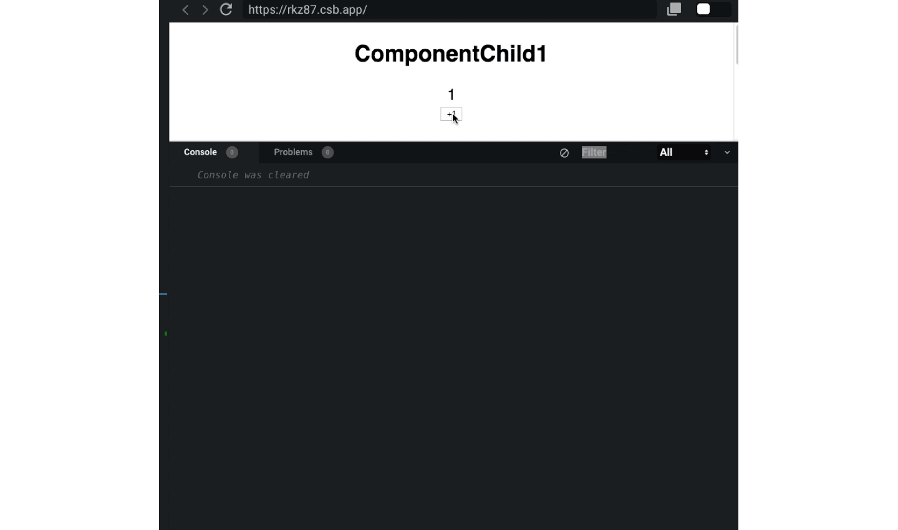
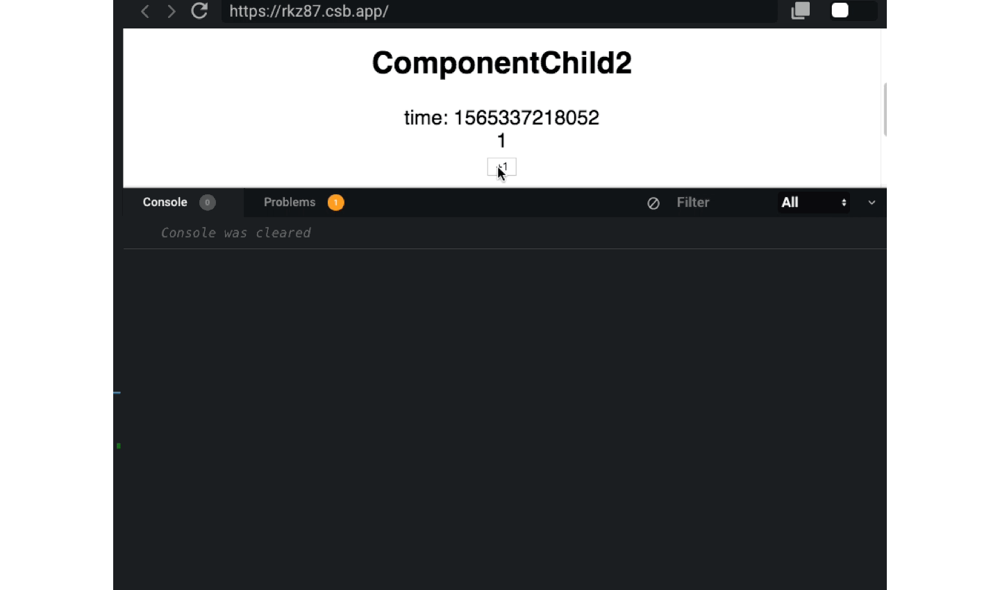
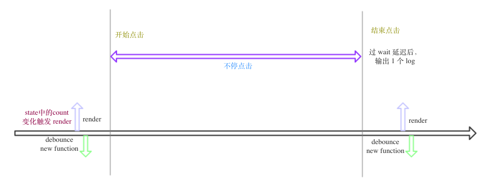
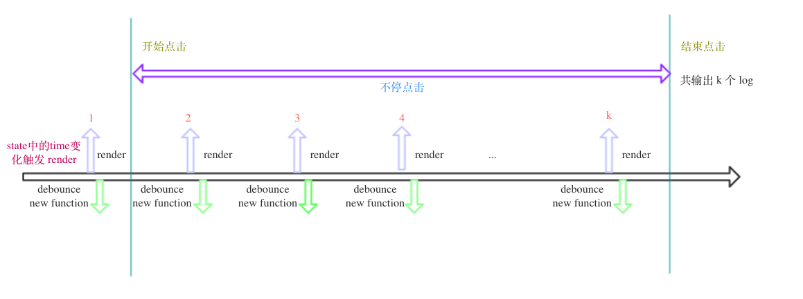

# react 中 debounce 的使用

> 第一次遇到问题，似懂非懂的解决了；第二次又遇到相同的问题，还是就这样解决了，没有思考背后深层次原因；第三次再次遇到，仍然不知所措，这时，你真的需要静下来搞懂了

debounce 的适用场景和所解决的问题在这里就不介绍了，如果没有相关知识先了解一下，再进行下文的阅读。

> 尽量用通俗易通的语言来讲解

[sandbox demo](https://codesandbox.io/s/fc-debounce-rkz87)

先来看个简单的计数类组件，实现的功能就是点击按钮进行+1计数

## 例一

### 类组件代码片段

```js
class ComponentChild1 extends React.Component {
  state = {
    count: 0
  };

  onClick = () => {
    console.log("debug-ComponentChild1-click-count", this.state.count);
    this.setState({
      count: this.state.count + 1
    });
  };

  render() {
    const {
      state: { count }
    } = this;

    return (
      <div>
        <h2>ComponentChild1</h2>
        <div>{count}</div>
        <button onClick={debounce(this.onClick, 4000)}>+1</button>
      </div>
    );
  }
}
```

### 测试效果



### 分析

不停点击 *+1* 按钮 发现 的确是延迟 一定时间输出一次 log

## 例二

### 类组件代码片段

```js
class ComponentChild2 extends React.Component {
  state = {
    count: 0,
    time: null
  };

  componentDidMount() {
    setInterval(() => {
      this.setState({ time: +new Date() });
    }, 1000);
  }

  onClick = () => {
    console.log("debug-ComponentChild-click-count", this.state.count);
    this.setState({
      count: this.state.count + 1
    });
  };

  render() {
    const {
      state: { count, time }
    } = this;

    return (
      <div>
        <h2>ComponentChild2</h2>
        <div>time: {time}</div>
        <div>{count}</div>
        <button onClick={debounce(this.onClick, 4000)}>+1</button>
      </div>
    );
  }
}
```

### 测试效果



### 分析

不停点击 *+1* 按钮 发现 的确是延迟 一定时间输出 log，可是为何输出多次 log 呢？

细细比较例一与例二，发现唯一的差别在于 `例二中每隔一段时间修改 state`，这样会导致 render 不停渲染，让我们先回到 事件绑定 `debounce` 函数上，多次 render 会导致生成多个 debounce 函数，而在每一个 render 上 触发的事件，都会执行 1次 事件回调。对于例二，每隔 1s 指定一次 render，生成一次 debounce 函数，导致我们频繁点击按钮发生在 多个 render函数上，也就是会执行多个 事件回调，可以说在一次 render 的点击有 debounce，而跨 render 间的点击就失效了，这一切都源于我们的 debounce 函数没有固定；而对于例一，虽然 count 变化也会导致 render，可是 debounce 函数的生成周期和 render 周期是一致的，但在使用 debounce 时，我们还是尽量把 debounce 函数 固定下来，这样就不必在 render 时重新生成新 function 了。

#### 例一示意图



#### 例二示意图




> 虽然力求言简意赅，可还是没有讲清晰，讲不清楚的应该是自己还是理不清楚，后面仍需精进，不过还是希望本文可以对理解 react 中使用 debounce 有所感悟。

## 注意事项

- debounce 的返回结果是一个函数
- state 修改 导致 render 渲染

## 总结