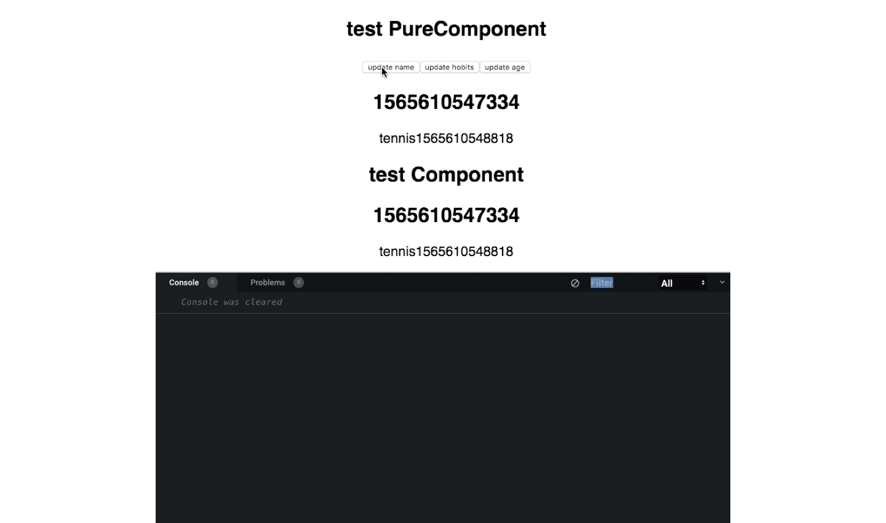

# React.PureComponent 使用

> 看了别人的总结，为什么还要自己理解着再写一遍？作为个人而言，写的过程也是加深理解，同时缕清知识脉络

首先我们先提一个牛人[Sophie Alpert](https://github.com/sophiebits)(和[Dan Abramov](https://github.com/gaearon)一样多产，我的偶像~~~)，`PureComponent` 就是这位牛人加入的。

## 是什么？解决了什么？

指定 [shallowEqual](https://github.com/facebook/fbjs/blob/c69904a511b900266935168223063dd8772dfc40/packages/fbjs/src/core/shallowEqual.js#L39) 为 `shouldComponentUpdate` 的对比函数，只做一层浅比较，以此避免无价值的父组件渲染导致子组件渲染。

那么，什么是没有价值的渲染呢？

比如说父组件传入子组件的数据并没有改变，而是其他字段改变导致的父组件渲染，那么这个时候的子组件的渲染被认为是无价值的。

详见下面的代码

[codepen demo](https://codesandbox.io/s/purecomponent-lzeyn)

### 测试效果

当父组件改变 `age` 字段时，本身不依赖于 `age` 的 Child 组件不应该更新，可是我们的 `React.Component`  `shouldComponentUpdate` 默认返回值是 true，即默认更新，而 `React.PureComponent` 可以做到 屏蔽掉不依赖字段改变的 `rerender`

## 总结

- 不需要自己自定义 equal 函数 的组件都可以使用 PureComponent 组件

## 参考

- [理解、使用 React.PureComponent](https://github.com/AnHongpeng/blog/issues/5)